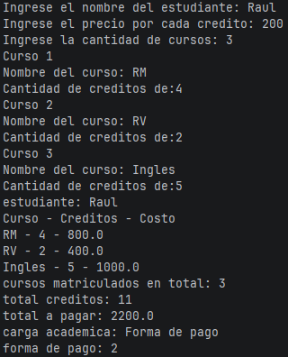

Este programa en Kotlin solicita interactivamente los datos de un estudiante, el precio por crédito y el detalle de cada curso matriculado (nombre y creditaje) para calcular el total de créditos acumulados y el costo final a pagar. A partir de estos datos, evalúa la condición de la carga académica del alumno y determina si la matrícula se puede cancelar en dos o tres cuotas según el monto total.

Captura de pantalla
